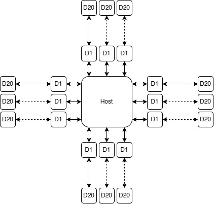
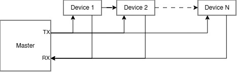
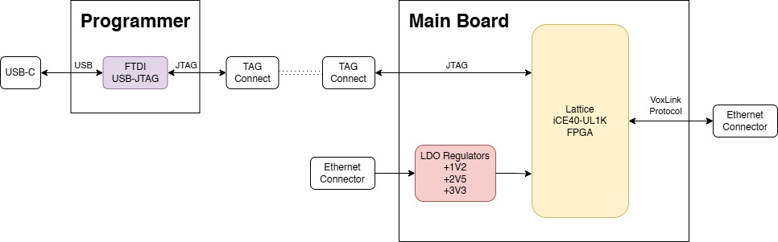

## Points for the meeting are marked with❗
# Protocol Parameters
### **⚠️ Warning: Parameters are still subject to change! ⚠️**
### ❗**Speed**: 50-100 MHz
$$
f_{\text{bandwidth}} = 2 \cdot f_{\text{sensor}} \cdot N_{\text{devices}} \cdot (L_{\text{header}} + L_{\text{data}}) 
$$
$$
9.6 \text{ MHz} = 2 \cdot 1000 \text{ Hz} \cdot 100 \cdot (12 + 32) 
$$

It may seem that 50-100 MHz is unreasonably fast, however, just 40 sensors at 9 kHz get very close to this ballpark. It is difficult to determine what may increase the bandwidth in the future, so it's important to rather have an excess than to have too little bandwidth. (Resulting bandwidth is the double of the calculated value to keep a reasonable margin of safety)

$$
34.56 \text{ MHz} = 2 \cdot 9000 \text{ Hz} \cdot 40 \cdot (12 + 32) 
$$

### ❗**Communication**: Full-Duplex 
   - Support for discovery
   - Configuration
### **Host**: 1
### **Sensor Branches from Host**: 10
### **Sensor Branch Length**: To be specified (20? 100?)

<!-- check something like profibus -->
<!-- zdielana zbernica vs serial -->
<!-- master can direct the communication -->
<!-- token approach -->

<!-- daisy chain: -->
<!-- what will be the worst case delay -->

# Communication Protocol
### Circular Master-Slave (Daisy Chain)
The Circular Master-Slave protocol offers unprecendented **advantages** when it comes to **timing** and **synchronization**. The Master sends out a packet containing the RX message to the sensor. When the sensor receives the data frame, it reads the content and rewrites it with TX. Each node has a place assigned where it reads and writes data. The discovery would also be easy, as the algorithm would look at the first position, where there are all zeros and would write it's address there. The next sensor would see this as talken and would use the next packet.

The main reason why this protocol **has not been chosen** is the inefficiency when it comes to **different clock domains**. Let's say we have a fast IMU, which sends data at 1 kHz and the resto of the sensors are tensometers sending data at 10 Hz. Because of the fast link, the tensometers would have to send 99 **empty packets for each data packet**, as the communication would have to happen at the frequency of the fastest link. This wastes the bandwidth, which is of great value when a large number of devices is connected.

### ❗Direct Master-Slave
The Direct Master-Slave is very **versatile to sampling frequency and packet size variance** between individual nodes. Furthermore it is easier to negotiate a custom packet size with the slave device. Having the freedom to implement changes like these is invaluable in the prototyping stage. This is why **we will implement this protocol!** Moreover we are **not wasting bandwidth**, as we are directly talking to the host device with no middle man.

# ❗Protocol Sections
 - Instance ID - Number assigned after self discovery
 - Board ID - Unique board identifier (can be requested but is not in the header)
 - Timestamp - Identification number of the packet
 - Data

| 7 Bits | 7 Bits | 4 Bits | Experimental | 16-64 Bits |
|:--------:|:--------:|:--------:|:--------:|:--------:|
| Instance ID | Length | Timestamp | CRC | Data |

# Physical Layer
### ❗Ethernet
Ethernet cables offer great **plug-and-play** connectivity while retaining **excellent signal integrity**. They come in a variety of sizes, however, the older cables do not feature a twisted pair configuration. Furthermore the modern CAT-5 cable is **bulky and difficult to route** inside the Voxel.

### FFC
FFC (Flexible Flat Cable) cables offer **good signal integrity** and can facilitate fast transmission speeds. Their flat profile allows for **easy integration** it the Voxel cells. A disadvantage is **difficult removal/insertion**, which is important for prototype devices. Furthermore, special, shielded cables are rather **expensive**.
## Wire Connections
### 8P8C
- 1-2 - TX
- 3-4 - RX
- 5-6 - CLK
- 7-8 - PWR

### 4P4C (Manchester Encoding)
- 1-2 - TX + Power
- 3-4 - RX

# Microcontroller options
## ❗**Lattice FPGA (iCE40) - (Chosen Platform)**
- **Cost**: 2.22$ to 3$
- **Speed**: 185 MHz
- **Flash Memory**: Not needed

After careful consideration the **Lattice FPGA** was chosen as the final platform for the sensor board over traditional MCUs. To achive the target speed in the ballpark of 50 MHz, the microcontrollers would have to be programmed in assebler. In this regard, **Verilog**, in which the FPGA chips will be programmed, is much **easier to read**, understand, and modify. A nice feature is the **integrated NVCM** (Non-Volatile Configuration Memory) inside of the FPGA, thus no external SPI Flash NVCM is needed!

Part number: **ICE40UL1K-CM36AI**

##  Rasperry Pi Pico (RP2350)
- **Cost**: 0.90$
- **Speed**: 150 MHz (Neil said 250 MHz overlocking is OK)
- **Flash Memory**: Needed
##  STM32H5
- **Cost**: 2.84$
- **Speed**: 250 MHz
- **Flash Memory**: Not needed

# Hardware Design

## ❗High Level Overview

### Connector selection
**Rule of thumb: $l_{\text{crit}}$** is $\frac{1}{12}^{\text{th}}$ of a signal wavelength in the dielectric material $\varepsilon$. The effective dielectric constant $\varepsilon$ for an outer-layer trace is approximately 3.3

$$
l_{\text{crit}} \text{ [m]} = \frac{c\text{ [m/s]}}{f_{\text{max}}\text{ [Hz]}} \cdot \frac{1}{\sqrt{\varepsilon}} \cdot \frac{1}{12}
$$

**Rise & fall times rule of thumb:**

$$
f_{\text{max}} \text{ [GHz]} \approx \frac{0.5}{t_{r/f} \text{ [ns]}}
$$

**Clock-to-rise-time rule of thumb:**

$$
t_{r/f} \text{ [ns]}\approx \frac{1}{10\cdot f_{\text{clk}}\text{ [GHz]}}
$$

**Calculation for maximum protocol clock:**

$$
1 \text{ [ns]}\approx \frac{1}{10\cdot 0.1\text{ [GHz]}}
$$

$$
500 \text{ [MHz]} \approx \frac{0.5}{1 \text{ [ns]}}
$$

$$
27.5 \text{ [mm]} \doteq \frac{3\cdot 10^{8}}{1\cdot 10^{6} \text{ Hz}} \cdot \frac{1}{\sqrt{3.3}} \cdot \frac{1}{12}
$$

This means the transmission line will appear as **lumped element** (no impedance matching needed as the reflections are negligible) only for **traces shorter than 27.5mm**. Anything **above** this length needs to be treated as a **distributed element** and requires **impedance matching**.

> ⚠️ **Impedance control is required for both the cable and the connector assembly!**

| Ethernet | USB |
|:--------:|:--------:|
| 100 Ω ± 15 Ω | 90 Ω ± 5 Ω |

Differential Impedance $Z_{\text{diff}}$ Comparison

$$
Z_{\text{diff}} = 2\cdot (Z_{0}-Z_{\text{coupling}})
$$

<!-- bno085 -->