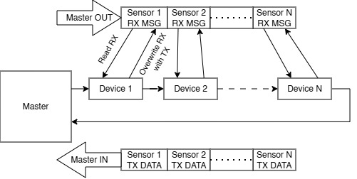

# Protocol Parameters
### **⚠️ Warning: Parameters are still subject to change! ⚠️**
### **Speed**: 50-100 MHz
$$
f_{\mathrm{bandwidth}} = 2 \cdot f_{\mathrm{sensor}} \cdot N_{\mathrm{devices}} \cdot (L_{\mathrm{header}} + L_{\mathrm{data}}) 
$$
$$
9.6 \mathrm{ MHz} = 2 \cdot 1000 \mathrm{ Hz} \cdot 100 \cdot (16 + 32) 
$$

It may seem that 50-100 MHz is unreasonably fast; however, just 40 sensors at 9 kHz get very close to this ballpark. It is difficult to determine what may increase the bandwidth in the future, so it's better to have an excess than to have too little bandwidth. (Resulting bandwidth is double the calculated value to keep a reasonable margin of safety)

$$
34.56 \mathrm{ MHz} = 2 \cdot 9000 \mathrm{ Hz} \cdot 40 \cdot (12 + 32) 
$$

### **Communication**: Full-Duplex 
   - Support for discovery
   - Configuration
### **Host**: 1
### **Sensor Branches from Host**: 10
### **Sensor Branch Length**: To be specified (20? 100?)

<!-- check something like profibus -->
<!-- zdielana zbernica vs serial -->
<!-- master can direct the communication -->
<!-- token approach -->

<!-- daisy chain: -->
<!-- what will be the worst case delay -->

# Communication Protocol
### Circular Master-Slave (Daisy Chain)
The Circular Master-Slave protocol offers unprecedented **advantages** when it comes to **timing** and **synchronization**. The Master sends out a packet containing the RX message to the sensor. When the sensor receives the data frame, it reads the content and rewrites it with TX. Each node has a place assigned where it reads and writes data. The discovery would also be easy, as the algorithm would look at the first position, where there are all zeros, and would write its address there. The next sensor would see this as talking and would use the next packet.

The main reason why this protocol **has not been chosen** is the inefficiency when it comes to **different clock domains**. Let's say we have a fast IMU, which sends data at 1 kHz, and the rest of the sensors are tensometers sending data at 10 Hz. Because of the fast link, the tensometers would have to send 99 **empty packets for each data packet**, as the communication would have to happen at the frequency of the fastest link. This wastes the bandwidth, which is of great value when a large number of devices are connected.

### Direct Master-Slave
The Direct Master-Slave is very **versatile to sampling frequency and packet size variance** between individual nodes. Furthermore, it is easier to negotiate a custom packet size with the slave device. Having the freedom to implement changes like these is invaluable in the prototyping stage. This is why **we will implement this protocol!** Moreover, we are **not wasting bandwidth**, as we are directly talking to the host device with no middleman.

# Protocol Sections
 - Instance ID - Number assigned after self-discovery
 - Board ID - Unique board identifier (can be requested but is not in the header)
 - Timestamp - Identification number of the packet
 - Data

| 7 Bits | 7 Bits | 4 Bits | Experimental | 16-64 Bits |
|:--------:|:--------:|:--------:|:--------:|:--------:|
| Instance ID | Length | Timestamp | CRC | Data |

# Physical Layer
### Ethernet
Ethernet cables offer great **plug-and-play** connectivity while retaining **excellent signal integrity**. They come in a variety of sizes, however, the older cables do not feature a twisted pair configuration. Furthermore the modern CAT-5 cable is **bulky and difficult to route** inside the Voxel.

### FFC
FFC (Flexible Flat Cable) cables offer **good signal integrity** and can facilitate fast transmission speeds. Their flat profile allows for **easy integration** it the Voxel cells. A disadvantage is **difficult removal/insertion**, which is important for prototype devices. Furthermore, special, shielded cables are rather **expensive**.
## Wire Connections
### 8P8C
- 1-2 - TX
- 3-4 - RX
- 5-6 - CLK
- 7-8 - PWR

### 4P4C (Manchester Encoding)
- 1-2 - TX + Power
- 3-4 - RX

# Microcontroller options
## **Lattice FPGA (iCE40) - (Chosen Platform)**
- **Cost**: 2.22$ to 3$
- **Speed**: 185 MHz
- **Flash Memory**: Used but not needed in the final design

After careful consideration, the **Lattice FPGA** was chosen as the final platform for the sensor board over traditional MCUs. To achieve the target speed in the ballpark of 50 MHz, the microcontrollers would have to be programmed in assembler. In this regard, **Verilog**, in which the FPGA chips will be programmed, is much **easier to read**, understand, and modify. A nice feature is the **integrated NVCM** (Non-Volatile Configuration Memory) inside the FPGA, thus no external SPI Flash NVCM is needed!

Part number: **ICE40UL1K-CM36AI**

##  Rasperry Pi Pico (RP2350)
- **Cost**: 0.90$
- **Speed**: 150 MHz (Neil said 250 MHz overlocking is OK)
- **Flash Memory**: Needed
##  STM32H5
- **Cost**: 2.84$
- **Speed**: 250 MHz
- **Flash Memory**: Not needed

# Hardware Design

## High Level Overview

### Connector selection
**Rule of thumb: $l_{\mathrm{crit}}$** is $\frac{1}{12}^{\mathrm{th}}$ of a signal wavelength in the dielectric material $\varepsilon$. The effective dielectric constant $\varepsilon$ for an outer-layer trace is approximately 3.3

$$
l_{\mathrm{crit}} \mathrm{ [m]} = \frac{c\mathrm{ [m/s]}}{f_{\mathrm{max}}\mathrm{ [Hz]}} \cdot \frac{1}{\sqrt{\varepsilon}} \cdot \frac{1}{12}
$$

**Rise & fall times rule of thumb:**

$$
f_{\mathrm{max}} \mathrm{ [GHz]} \approx \frac{0.5}{t_{r/f} \mathrm{ [ns]}}
$$

**Clock-to-rise-time rule of thumb:**

$$
t_{r/f} \mathrm{ [ns]}\approx \frac{1}{10\cdot f_{\mathrm{clk}}\mathrm{ [GHz]}}
$$

**Calculation for the maximum protocol clock:**

$$
1 \mathrm{ [ns]}\approx \frac{1}{10\cdot 0.1\mathrm{ [GHz]}}
$$

$$
500 \mathrm{ [MHz]} \approx \frac{0.5}{1 \mathrm{ [ns]}}
$$

$$
27.5 \mathrm{ [mm]} \doteq \frac{3\cdot 10^{8}}{1\cdot 10^{6} \mathrm{ Hz}} \cdot \frac{1}{\sqrt{3.3}} \cdot \frac{1}{12}
$$

This means the transmission line will appear as a **lumped element** (no impedance matching needed as the reflections are negligible) only for **traces shorter than 27.5mm**. Anything **above** this length needs to be treated as a **distributed element** and requires **impedance matching**.

> ⚠️ **Impedance control is required for both the cable and the connector assembly!**

| Ethernet | USB |
|:--------:|:--------:|
| 100 Ω ± 15 Ω | 90 Ω ± 5 Ω |

Differential Impedance $Z_{\mathrm{diff}}$ Comparison

$$
Z_{\mathrm{diff}} = 2\cdot (Z_{0}-Z_{\mathrm{coupling}})
$$

## Schematic Diagram - Sensor Board

### eFuse

The eFuse circuit protects the onboard LDOs from excessive overvoltages. The overvoltage protection (OVP) threshold has been set to 5.4V. This gives enough headroom for the absolute maximum voltage of the LDO at 6.5V. The undervoltage lockout (UVLO) threshold has been set to 4V.

**It is crucial for C101 and R101 to be rated at 100V!** Long enough cables can cause surges at the capacitor of over double the input voltage. The limiting resistor will aid in this issue. For further details, refer to the AN88F application note from Analog Devices.

### Power Section

FPGAs require a **specific voltage** to enable their operation. In this design, we are working with 4 different voltage levels:

| 5V | 3.3V | 2.5V | 1.2V |
|:--------:|:--------:|:--------:|:--------:|
| Supply voltage from the power cables | The I/O voltages (used by GPIO pins) | The Non-Volatile Configuratio Memory (NVCM) voltage | The FPGA core voltage | 

This version of the board features a 2.5V voltage regulator, which is usually omitted in many designs. The absolute maximum rating of the $V_{\mathrm{PP\_2V5}}$ supplying the NVCM voltage is 2.3V to 3.46V. This enables the pin to be directly connected to the 3.3V voltage regulator. To get the voltage closer to 2.5V, a diode is placed from the 3.3V to the NVCM supply, which facilitates a drop of roughly 0.7V.

There are three I/O banks on the FPGA. The Bank 0, Bank 1, and Bank 2; they all can have different voltage levels connected to them. In this board, all of the I/O banks are running at 3.3V; however, the power is sectioned into VCCIO0, VCCIO1, and VCCIO2. This is to indicate the exact I/O bank that the voltage is tied to, should any future changes be made.

Furthermore, the power supplies are brought up in the order specified in the datasheet. However, I have seen FPGA boards such as the TinyFPGA-BX not follow the correct follow-up sequence. I have also heard that an incorrect power-up sequence will trigger a protection diode on the inside of the FPGA, which can become a problem during prolonged power-up, which is a rather unusual case. Nonetheless, the correct power sequence was programmed using the enable chips. The $\mathrm{V}_{\mathrm{EN(LOW)}} = 0.3 \mathrm{V}$ and $\mathrm{V}_{\mathrm{EN(HIGH)}} = 0.9 \mathrm{V}$, so the 1.2V FPGA core voltage can be used as an enable signal of the next regulator. Below is the datasheet recommendation:

> It is recommended to bring up the power supplies in the following order. Note that there is no specified timing delay
between the power supplies; however, there is a requirement for each supply to reach a level of 0.5 V or higher.
before any subsequent power supplies in the sequence are applied.

- $\mathrm{V} _{\mathrm{CC}}$ and $\mathrm{V} _{\mathrm{CC\_PLL}}$
- $\mathrm{V_{CCIO1\_SPI}}$
- $\mathrm{V} _{\mathrm{PP\_2V5}}$
- Other Supplies

A delay block is introduced to delay the startup of the FPGA chip. This is necessary as the FPGA suggests the memory needs to be ready to accept commands after 10us of the FPGA power-up. Since the NOR flash chip is powered from 3V3, which is the same voltage powering the $\mathrm{SPI-V} _{\mathrm{CCIO1}}$, we need to consider the $t_{VTR} = 150 \mu \mathrm{S}$ which is the time from($\mathrm{V_{CC(MIN)}}$ to Read). The delay value was chosen as 20ms, as the capacitor selection for such a time is 32pF. Having a shorter time means selecting a smaller capacitor, which may become unreliable due to parasitic board capacitances.

### System

In this section, the majority of the FPGA chip is routed. One of the most important parts is the SPI Flash memory. As the Lattice iCE40 UltraLite is a low-cost device, the flash memory peripheral is not programmed by the chip directly. In order to program the FPGA, the $\overline{\mathrm{CRESET}}$ needs to be pulled LOW. This puts the FPGA in reset, and the FLASH_... signals can be used to program the memory. When done, the FPGA reset is de-asserted, and the FPGA loads the configuration from the memory upon power-up.

An external oscillator is used to provide a more stable clock than the integrated FPGA reference clocks. An oscillator needs to be used as the FPGA does not have support for crystal oscillators. The G (GBUF) marking on the pins indicates an internal G-Buf FPGA fabric connection for high-speed routing. This is a special routing layer inside the FPGA that can carry signals up to 185 MHz. The internal system clock, as well as the external clock for the PLL, needs to be connected via this layer.

The VoxLink Ethernet Connection is the physical interface of the sensor board. Currently, the board is configured to utilize the internal differential comparators of the FPGA (A and B pins). Note that the IOB_6A and IOB_7B_G5 form a one differential comparator pair. Ideally, a differential pair will be used to carry the signal to minimize interference. A no-placement (NOP) resistors are used to give the option of a single-ended signal, where the inverted rail can be connected to ground to improve the return path.

### Sensor

The sensor page is the connection of the BNO086 IMU to the FPGA. A reference design from the Adafruit breakout board was chosen.

> CEVA recommends using a crystal with tolerance
50ppm with 12.5pF capacitor loading.

A crystal with a specified load capacitance of 12.5pF and a PPM of 20 was chosen to satisfy the datasheet value. The crystal load capacitors are then calculated based on the following equation:

$$
(12.5p \mathrm{F Load Capacitance} - 5p \mathrm{F Stray Capacitance}) * 2 = 15p \mathrm{F Load Capacitors}
$$

### Connectivity

Two possible architectures were discussed in the earlier sections: the BUS topology and the DAISY chain approach. The sensor evaluation board has an integrated PCIe-Gen4 switch IC, which can rewire the connection from one architecture to another. The images below show the different connections facilitating each approach. Within both architectures, both TX and CLK differential pairs are always connected from the input to the output. This allows us to change the architecture with just one DPDT switch. Having used a dedicated IC, this will ensure better impedance control than using a mechanical switch.

## Schematic Diagram - Programmer Board
An FTDI223HQ IC was used as the serial-to-USB converter. To reduce the overall cost of each sensor board, an external programmer was designed. An EEPROM is attached to the FTDI chip, which can store basic configuration such as the device name and version. This information can be configured using the [FT_Prog](https://ftdichip.com/utilities/#ft_prog) software. A 93LC56B EEPROM IC was selected based on datasheet recommendations, and the chip is merely optional. The FTDI chip does not appear to store any critical information within.

A Tag Connect TC2030-IDC programming cable will be used to program the SPI Flash memory. The pinout of the IDC connector was taken from the datasheet, and the correct pin assignment has to be tested on the hardware implementation, as its correctness is not yet confirmed. An additional 8-pin PicoBlade connector was used to have access to the $\mathrm{CDONE}$ and $\overline{\mathrm{CRESET}}$ signals (the Tag Connect only offers 6 pins), as well as try out different programming interfaces. The manufacturer's evaluation board uses all 8 signals; however, it may be possible to use only 6.

## PCB Layout

### Controlled Impedance

Since Ethernet connectors were used in the design, the differential pairs were routed with a controlled differential impedance of $100 \Omega$. The stackup for both the programmer and the sensor boards can be seen below. An impedance calculator from the PCB manufacturer was used to determine the correct trace parameters. The differential pair trace width used in the design was 0.1mm, and the gap was 0.2mm. 

### Constraints

The constraints were taken from the manufacturer's capabilities page and copied into KiCad. The exact values can be seen below.

### PCB Rework

After talking to the manufacturer, I was informed that the custom BGA footprint I have designed was **not manufacturable**. The pad size I used for the fanout was 0.1mm, and the minimum was 0.25mm, which meant I had to rework my PCB design. Unfortunately, **I had to use capped in-pad vias with 0.15mm drill size** to get around this issue. This is right at the manufacturer's limits, which increases the cost by a few euros; however, I do not see this as a problem with the evaluation design I am ordering. Below is an image provided by JLCPCB engineers of my flawed footprint design.

